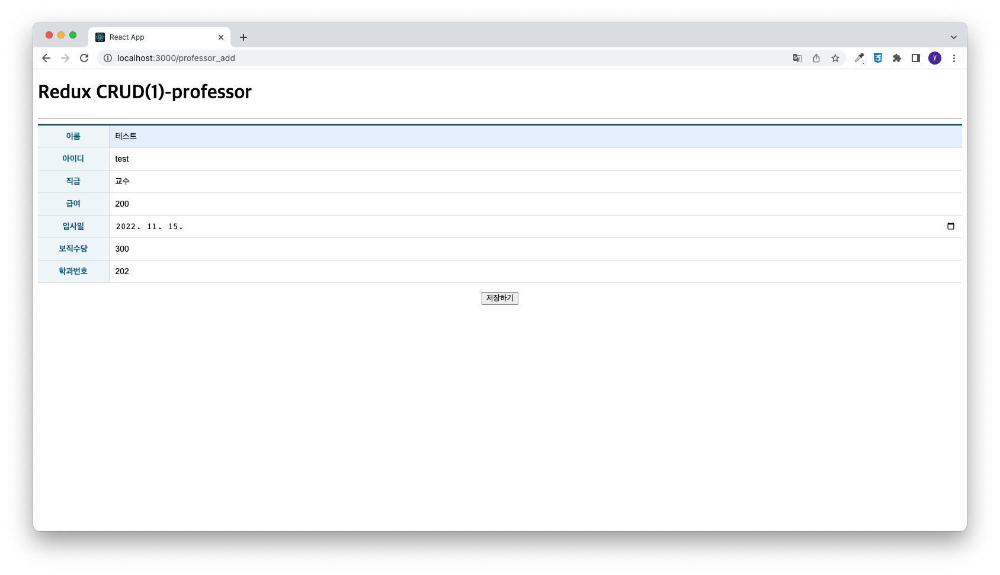
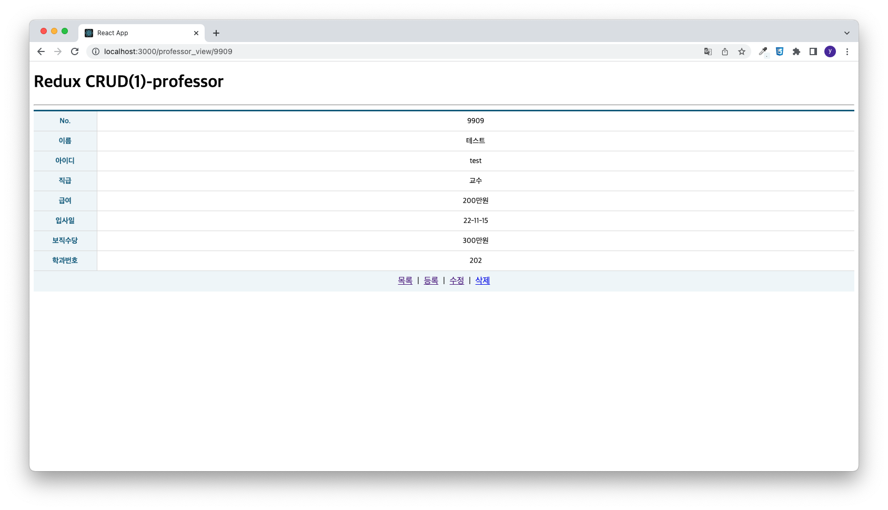
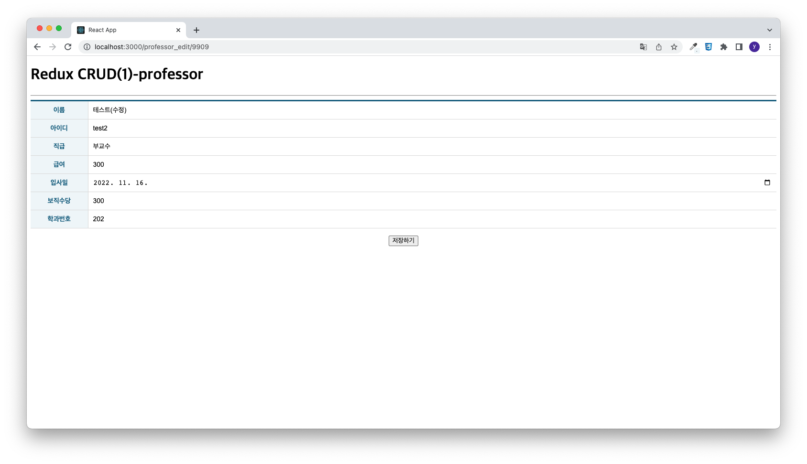
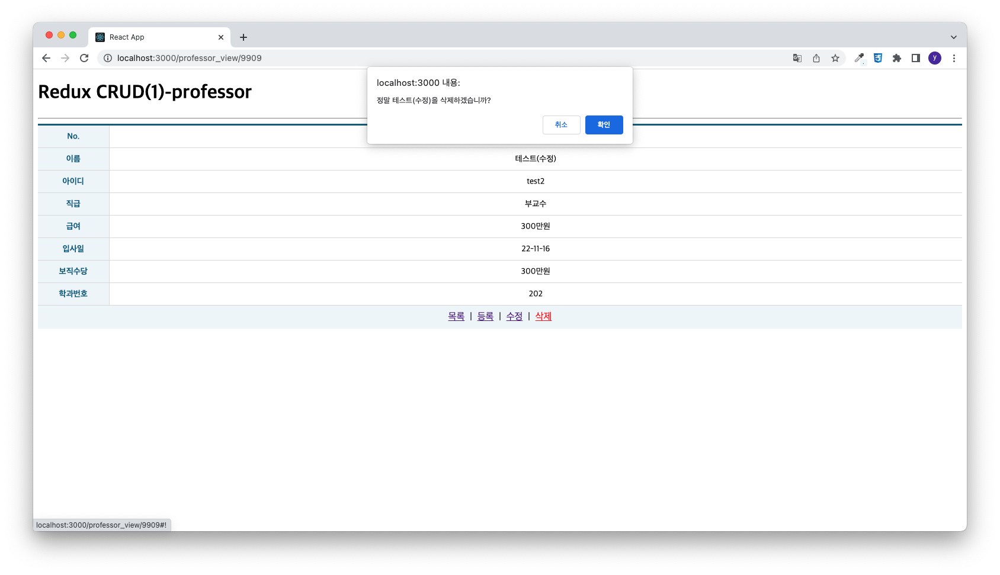
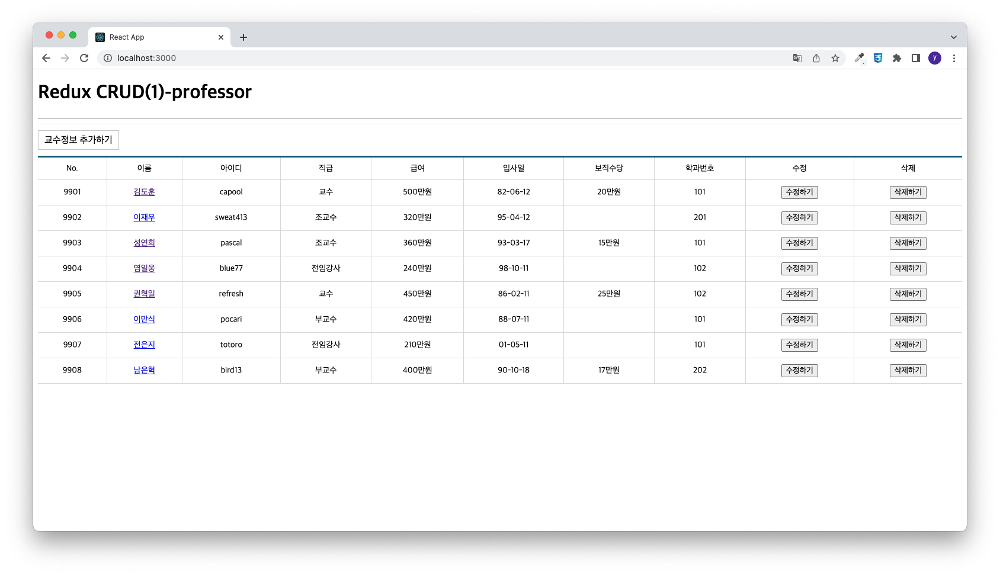

# 유지인 Redux CRUD(1)-professor 과제

> 2022-11-16

## App.js

```javascript
import React, { memo } from "react";
import { Routes, Route } from 'react-router-dom';

import ProfessorList from "./pages/ProfessorList";
import ProfessorAdd from "./pages/ProfessorAdd";
import ProfessorView from "./pages/ProfessorView";
import ProfessorEdit from "./pages/ProfessorEdit";


const App = memo(() => {
  return (
    <div>
      <h1>Redux CRUD(1)-professor</h1>

      <hr />

      <Routes>
        <Route path='/' exapt={true} element={<ProfessorList />} />
        <Route path='/professor_add' element={<ProfessorAdd />} />
        <Route path='/professor_view/:id' element={<ProfessorView />} />
        <Route path='/professor_edit/:id' element={<ProfessorEdit />} />
      </Routes>
    </div>
  );
});

export default App;

```

## index.js

```javascript
import React from "react";
import ReactDOM from "react-dom/client";


import App from "./App";
/*/
import App from './Test';
/**/ 

import { BrowserRouter } from "react-router-dom";
import { Provider } from "react-redux";
import store from "./store";

const root = ReactDOM.createRoot(document.getElementById("root"));
root.render(
  <Provider store={store}>
    <BrowserRouter>
      <App />
    </BrowserRouter>
  </Provider>
);

```

## store.js

```javascript
import { configureStore } from "@reduxjs/toolkit"
import ProfessorSlice from "./slice/ProfessorSlice"


const store = configureStore({
    reducer: {
        ProfessorSlice: ProfessorSlice,
    }
});

export default store;
```

## /slice/ProfessorSlice.js

```javascript
import { createSlice, createAsyncThunk } from "@reduxjs/toolkit";
import axios from "axios";
import { pending, fulfilled, rejected} from '../helper/ReduxHelper';
import { cloneDeep } from "lodash";

/** 다중행 데이터 조회를 위한 비동기 함수 */
export const getList = createAsyncThunk("ProfessorSlice/getList", async( payload, { rejectWithValue }) => {
    let result = null;
    const URL = process.env.REACT_APP_API_PROFESSOR_LIST;

    try {
        const response = await axios.get(URL);
        result = response.data;
    } catch (err) {
        result = rejectWithValue(err.response);
    }

    return result;
});

/** 단행 데이터 조회를 위한 비동기 함수 */
export const getItem = createAsyncThunk("ProfessorSlice/getItem", async( payload, { rejectWithValue }) => {
    let result = null;
    const URL = process.env.REACT_APP_API_PROFESSOR_ITEM.replace(':id', payload.id);

    try {
        const response = await axios.get(URL);
        result = response.data;
    } catch (err) {
        result = rejectWithValue(err.response);
    }

    return result;
});

/** 데이터 저장을 위한 비동기 함수 */
export const postItem = createAsyncThunk("ProfessorSlice/postItem", async( payload, { rejectWithValue }) => {
    let result = null;
    const URL = process.env.REACT_APP_API_PROFESSOR_LIST;

    try {
        const response = await axios.post(URL, {
            name: payload.name,
            userid: payload.userid,
            position: payload.position,
            sal: payload.sal,
            hiredate: payload.hiredate,
            comm: payload.comm,
            deptno: payload.deptno,
        });
        result = response.data;
    } catch (err) {
        result = rejectWithValue(err.response);
    }

    return result;
});

/** 데이터 수정을 위한 비동기 함수 */
export const putItem = createAsyncThunk("ProfessorSlice/putItem", async( payload, { rejectWithValue }) => {
    let result = null;
    const URL = process.env.REACT_APP_API_PROFESSOR_ITEM.replace(':id', payload.id);

    try {
        const response = await axios.put(URL, {
            name: payload.name,
            userid: payload.userid,
            position: payload.position,
            sal: payload.sal,
            hiredate: payload.hiredate,
            comm: payload.comm,
            deptno: payload.deptno,
        });
        result = response.data;
    } catch (err) {
        result = rejectWithValue(err.response);
    }

    return result;
});

/** 데이터 삭제를 위한 비동기 함수 */
export const deleteItem = createAsyncThunk("ProfessorSlice/deleteItem", async( payload, { rejectWithValue }) => {
    let result = null;
    const URL = process.env.REACT_APP_API_PROFESSOR_ITEM.replace(':id', payload.id);

    try {
        const response = await axios.delete(URL);
        result = response.data;
    } catch (err) {
        result = rejectWithValue(err.response);
    }

    return result;
});

const ProfessorSlice = createSlice({
    name: 'ProfessorSlice',
    // 이 모듈이 관리하고자하는 상태값들을 명시
    initialState: {
        data: null,
        loading: false,
        error: null
    },
    reducers : {
        getCurrentData: (state, action) => {
            return state
        }
    },
    extraReducers: {
        /** 다중행 데이터 조회를 위한 액션 함수 */
        [getList.pending]: pending,
        [getList.fulfilled]: fulfilled,
        [getList.rejected] : rejected,

        /** 단일행 데이터 조회를 위한 액션 함수 */
        [getItem.pending]: pending,
        [getItem.fulfilled]: (state, {meta, payload}) => {
            return {
                data: [payload],
                loading: false,
                error: null
            }
        },
        [getItem.rejected] : rejected,

        /** 데이터 저장을 위한 액션 함수 */
        [postItem.pending]: pending,
        [postItem.fulfilled]: (state, { meta, payload }) => {
            // 기존 상태값 깊은 복사 처리
            const data = cloneDeep(state.data);
            console.log(data);

            // 새로 저장된 결과를 기존 상대값 배열에 추가
            data.push(payload);

            return {
                data: data,
                loading: false,
                error: null
            }
        },
        [postItem.rejected] : rejected,

        /** 데이터 수정을 위한 액션 함수 */
        [putItem.pending]: pending,
        [putItem.fulfilled]: (state, {meta, payload}) => {
            // 기존 상태값 깊은 복사 처리
            const data= cloneDeep(state.data);

            // id값이 일치하는 항목의 배열 인덱스 찾기
            const targetId = data.findIndex((v, i) => v.id == meta.arg.id);
            console.log(targetId);

            // 해당 인덱스의 원소를 백엔드의 응답 결과로 교체한다.
            data.splice(targetId, 1, payload);

            return {
                data: data,
                loading: false,
                error: null
            }
        },
        [putItem.rejected] : rejected,

        /** 데이터 삭제를 위한 액션 함수 */
        [deleteItem.pending]: pending,
        [deleteItem.fulfilled]: (state, {meta, payload}) => {
            // 기존 상태값 깊은 복사 처리
            const data= cloneDeep(state.data);

            // id값이 일치하는 항목의 배열 인덱스 찾기
            const targetId = data.findIndex((v, i) => v.id == meta.arg.id);
            console.log(targetId);
            
            // 해당 인덱스의 원소 삭제
            data.splice(targetId, 1);

            return {
                data: data,
                loading: false,
                error: null
            }
        },
        [deleteItem.rejected] : rejected,
    },
});

export const { getCurrentData } = ProfessorSlice.actions;
export default ProfessorSlice.reducer;
```

## /pages/ProfessorList.js

```javascript
import React, { memo, useCallback, useEffect} from 'react';
import { Navigate, NavLink, useNavigate } from 'react-router-dom';

import Spinner from '../components/Spinner';
import ErrorView from '../components/ErrorView';
import Table from '../components/Table';

import { useSelector, useDispatch } from 'react-redux';
import { getList, deleteItem } from '../slice/ProfessorSlice';

import styled from 'styled-components';

import dayjs from 'dayjs';

// 교수정보 추가하기 박스
const AddContainer = styled.form`
    position: sticky;
    top: 0;
    background-color: #fff;
    border-top: 1px solid #eee;
    padding: 10px 0;
    
    .controll {
        margin-right: 5px;
        display: inline-block;
        font-size: 16px;
        padding: 7px 10px 5px 10px;
        border: 1px solid #ccc
    }

    .clickable {
        background-color: #fff;
        color: #000;
        text-decoration: none;
        cursor: pointer;

        &:hover {
            background-color: #06f2;
        }

        &:active {
            transform: scale(0.9, 0.9);
        }
    }

`

const ProfessorList = memo(() => {
    /** 리덕스 관련 초기화 */
    const dispatch = useDispatch();
    const { data, loading, error } = useSelector((state) => state.ProfessorSlice);

    /** 최초 마운트 시 리덕스를 통해 목록을 조회한다. */
    useEffect(() => {
        dispatch(getList());
    },[]);

    // 페이지 강제 이동을 처리하기 위한 navigate 함수 생성
    const navigate = useNavigate();

    /** 삭제 버튼에 대한 이벤트 리스너 */
    const onProfessorItemDelete = useCallback((e) => {
        e.preventDefault();

        const current = e.target;
        const { id, name, userid, position, sal, hiredate, comm, deptno} = current.dataset;

        if (window.confirm(`정말 ${name}을 삭제하겠습니까?`)) {
            dispatch(deleteItem({
                id: id
            }))
        }
    },[]);

    /** 수정 버튼에 대한 이벤트 리스너 */
    const onProfessorEditClick = useCallback((e) => {
        e.preventDefault();

        const current = e.target;
        const { id } = current.dataset;

        navigate(`/professor_edit/${id}`);
    })


  return (
    <div>
        {/* 로딩바 */}
        <Spinner loading={loading} />

        {/* 데이터 추가폼 */}
        <AddContainer>
            <NavLink to='professor_add' className='controll clickable'>교수정보 추가하기</NavLink>
        </AddContainer>

        {/* 조회 결과 표시하기 */}
        {error? (
            <ErrorView error={error} />
        ) : (
            // Ajax 처리 결과가 존재할 경우
            data && (
                <Table>
                    <thead>
                        <tr>
                            <td>No.</td>
                            <td>이름</td>
                            <td>아이디</td>
                            <td>직급</td>
                            <td>급여</td>
                            <td>입사일</td>
                            <td>보직수당</td>
                            <td>학과번호</td>
                            <td>수정</td>
                            <td>삭제</td>
                        </tr>
                    </thead>
                    <tbody>
                        {
                            // 데이터 수가 0건인 경우를 구분
                            data.length > 0 ? (
                                data.map(({id, name, userid, position, sal, hiredate, comm, deptno}, i) => {
                                    return (
                                        <tr key={id}>
                                            <td>{id}</td>
                                            <td><NavLink to={`/professor_view/${id}`}>{name}</NavLink></td>
                                            <td>{userid}</td>
                                            <td>{position}</td>
                                            <td>{sal && `${sal}만원`}</td>
                                            <td>{hiredate ? (dayjs(hiredate).format('YY-MM-DD')) : ('')}</td>
                                            <td>{comm && `${comm}만원`}</td>
                                            <td>{deptno}</td>
                                            <td>
                                                <button type='button' data-id={id} onClick={onProfessorEditClick}>
                                                    수정하기
                                                </button>
                                            </td>
                                            <td>
                                                <button type='button' onClick={onProfessorItemDelete} data-id={id} data-name={name} data-userid={userid} data-position={position} data-sal={sal} data-hiredate={hiredate} data-comm={comm} data-deptno={deptno}>
                                                    삭제하기
                                                </button>
                                            </td>
                                        </tr>
                                    )
                                })
                            ) : (
                                <tr>
                                    <td colSpan='10' align='center'>
                                        검색결과가 없습니다.
                                    </td>
                                </tr>
                            )
                        }
                    </tbody>
                </Table>
            )
        )}
    </div>
  );
});

export default ProfessorList;
```

## /pages/ProfessorAdd.js

```javascript
import React, { memo, useCallback } from "react";
import { useNavigate } from "react-router-dom";
import { useSelector, useDispatch } from "react-redux";
import { postItem } from "../slice/ProfessorSlice";

import Spinner from "../components/Spinner";
import ErrorView from "../components/ErrorView";
import TableEx from "../components/TableEx";

import dayjs from "dayjs";

const ProfessorAdd = memo(() => {
  /** 저장 완료 후 목록으로 되돌아가기 위한 강제 이동 함수 설정 */
  const navigate = useNavigate();

  /** 리덕스 관련 초기화 */
  const dispatch = useDispatch();
  const { loading, error } = useSelector((state) => state.ProfessorSlice);

  /** <form>의 submit 버튼이 눌러졌을 때 호출될 이벤트 핸들러 */
  const onProfessorSubmit = useCallback((e) => {
    e.preventDefault();

    // 이벤트가 발생한 폼 객체
    const current = e.currentTarget;

    // 리덕스를 통한 데이터 저장 요청
    dispatch(postItem({
        name: current.name.value,
        userid: current.userid.value,
        position: current.position.value,
        sal: parseInt(current.sal.value),
        hiredate: dayjs(current.hiredate.value).toISOString(),
        comm: parseInt(current.comm.value),
        deptno: parseInt(current.deptno.value),
      })).then((result) => {
      console.log(result);
      // 처리가 완료된 후 상세 페이지로 이동
      navigate(`/professor_view/${result.payload.id}`);
    });
  }, []);

  return (
    <div>
      {/* 로딩바 */}
      <Spinner loading={loading} />

      {error ? (
        <ErrorView error={error} />
      ) : (
        <form onSubmit={onProfessorSubmit}>
          <TableEx>
            <colgroup>
              <col width="120" />
              <col />
            </colgroup>
            <tbody>
              <tr>
                <th>이름</th>
                <td className="inputWrapper">
                  <input className="field" type="text" name="name" />
                </td>
              </tr>
              <tr>
                <th>아이디</th>
                <td className="inputWrapper">
                  <input className="field" type="text" name="userid" />
                </td>
              </tr>
              <tr>
                <th>직급</th>
                <td className="inputWrapper">
                  <input className="field" type="text" name="position" />
                </td>
              </tr>
              <tr>
                <th>급여</th>
                <td className="inputWrapper">
                  <input className="field" type="text" name="sal" placeholder="숫자만 입력하세요."/>
                </td>
              </tr>
              <tr>
                <th>입사일</th>
                <td className="inputWrapper">
                  <input className="field" type="date" name="hiredate" />
                </td>
              </tr>
              <tr>
                <th>보직수당</th>
                <td className="inputWrapper">
                  <input className="field" type="text" name="comm" placeholder="숫자만 입력하세요." />
                </td>
              </tr>
              <tr>
                <th>학과번호</th>
                <td className="inputWrapper">
                  <input className="field" type="text" name="deptno" />
                </td>
              </tr>
            </tbody>
          </TableEx>

          <div style={{ textAlign: "center" }}>
            <button type="submit">저장하기</button>
          </div>
        </form>
      )}
    </div>
  );
});

export default ProfessorAdd;

```

## /pages/ProfessorView.js

```javascript
import React, { memo, useEffect, useMemo, useCallback } from 'react';
import { NavLink, useParams, useNavigate } from 'react-router-dom';
import { useSelector, useDispatch } from 'react-redux';
import { getCurrentData, getItem, deleteItem } from '../slice/ProfessorSlice';

import Spinner from '../components/Spinner';
import ErrorView from '../components/ErrorView';
import Table from '../components/Table';

import dayjs from 'dayjs';

const ProfessorView = memo(() => {
    /** path 파라미터 받기 */
    const { id } = useParams();

    /** 리덕스 관련 초기화 */
    const dispatch = useDispatch();
    const { data, loading, error } = useSelector((state) => state.ProfessorSlice);

    /** 데이터 가져오기 */
    useEffect(() => {
        dispatch(getCurrentData());
    },[]);

    console.log(data);
    
    /** data값의 변경에 따른 사이드 이펙트 처리 */
    const item = useMemo(() => {
        if(data) {
            return data.find((v, i) => v.id == id);
        } else {
            // 새로고침 시 현재 데이터만 다시 로드함
            dispatch(getItem({id : id}));
        }
    },[data]);

    /** 페이지 강제 이동 처리를 위한 navigate 함수 설정 */
    const navigate = useNavigate();
    
    /** 삭제 버튼에 대한 이벤트 리스너 */
    const onProfessorItemDelete = useCallback((e) => {
        e.preventDefault();

        const current = e.target;
        const { id, name, userid, position, sal, hiredate, comm, deptno} = current.dataset;

        if (window.confirm(`정말 ${name}을 삭제하겠습니까?`)) {
            dispatch(deleteItem({
                id: id
            })).then(({ meta, payload }) => {
                // 삭제 후 목록 페이지로 강제이동
                navigate('/');
            });
        }
    },[]);


    console.log(item);

    /** 테이블 생성을 위한 데이터 JSON 배열 */
    // const profList = [
    //     {title : 'No.', data: 'id'},
    //     {title : '이름', data: 'name'},
    //     {title : '아이디', data: 'userid'},
    //     {title : '직급', data: 'position'},
    //     {title : '급여', data: 'sal'},
    //     {title : '입사일', data: 'hiredate'},
    //     {title : '보직수당', data: 'comm'},
    //     {title : '학과번호', data: 'deptno'},
    // ];

  return (
    <div>
        {/* 로딩바 */}
        <Spinner loading={loading} />

        {error? (
            <ErrorView error={error} /> 
        ) : (
            // id값과 일치하는 데이터가 있다면
            item && (
                <div>
                    <Table>
                        <colgroup>
                            <col width='120' />
                            <col />
                        </colgroup>
                        <tbody>
                            {/* {profList.map((v, i) => {
                                return (
                                    <tr key={i}>
                                    <th>{v.title}</th>
                                    <td>{item[v.data]}</td>
                                </tr>
                                )
                            })} */}
                            <tr>
                                <th>No.</th>
                                <td>{item.id}</td>
                            </tr>
                            <tr>
                                <th>이름</th>
                                <td>{item.name}</td>
                            </tr>
                            <tr>
                                <th>아이디</th>
                                <td>{item.userid}</td>
                            </tr>
                            <tr>
                                <th>직급</th>
                                <td>{item.position}</td>
                            </tr>
                            <tr>
                                <th>급여</th>
                                <td>{item.sal}만원</td>
                            </tr>
                            <tr>
                                <th>입사일</th>
                                <td>{dayjs(item.hiredate).format('YY-MM-DD')}</td>
                            </tr>
                            <tr>
                                <th>보직수당</th>
                                <td>{item.comm}만원</td>
                            </tr>
                            <tr>
                                <th>학과번호</th>
                                <td>{item.deptno}</td>
                            </tr>

                        </tbody>
                    </Table>

                    <div style={{ textAlign: 'center ', padding: '10px', backgroundColor: '#f0f6f9'}}>
                        <NavLink to='/'>목록</NavLink>
                        &nbsp; | &nbsp;
                        <NavLink to='/professor_add'>등록</NavLink>
                        &nbsp; | &nbsp;
                        <NavLink to={`/professor_edit/${item.id}`}>수정</NavLink>
                        &nbsp; | &nbsp;
                        <NavLink to='#!' onClick={onProfessorItemDelete} data-id={item.id} data-name={item.name} data-userid={item.userid} data-position={item.position} data-sal={item.sal} data-hiredate={item.hiredate} data-comm={item.comm} data-deptno={item.deptno} >삭제</NavLink>
                    </div>
                </div>
            )
        )}
    </div>
  );
});

export default ProfessorView;
```

## /pages/ProfessorEdit.js

```javascript
import React, { memo, useCallback, useEffect, useMemo } from "react";
import { useSelector, useDispatch } from "react-redux";
import { useParams, useNavigate } from "react-router-dom";
import { getItem, getCurrentData, putItem } from "../slice/ProfessorSlice";

import Spinner from "../components/Spinner";
import ErrorView from "../components/ErrorView";
import TableEx from "../components/TableEx";

import dayjs from "dayjs";

const ProfessorEdit = memo(() => {
  /** path 파라미터 받기 */
  const { id } = useParams();

  /** 리덕스 관련 초기화 */
  const dispatch = useDispatch();
  const { data, loading, error } = useSelector(
    (state) => state.ProfessorSlice
  );

  /** 데이터 가져오기 */
  useEffect(() => {
    dispatch(getCurrentData());
  }, []);

  /** data값의 변경에 따른 사이드 이펙트 처리 */
  const item = useMemo(() => {
    if (data) {
      return data.find((v, i) => v.id == id);
    } else {
      // 새로 고침 시 현재 데이터만 다시 로드함
      dispatch(getItem({ id: id }));
    }
  }, [data]);

  /** 페이지 강제 이동을 처리하기 위한 navigate 함수 생성 */
  const navigate = useNavigate();

  /** <form>의 submit 버튼이 눌러졌을 때 호출될 이벤트 핸들러 */
  const onProfessorSubmit = useCallback((e) => {
    e.preventDefault();

    // 이벤트가 발생한 폼 객체
    const current = e.currentTarget;

    // 리덕스를 통한 데이터 저장 요청
    dispatch(putItem({
        id: current.id.value,
        name: current.name.value,
        userid: current.userid.value,
        position: current.position.value,
        sal: current.sal.value,
        hiredate: current.hiredate.value,
        comm: current.comm.value,
        deptno: current.deptno.value,
    })).then((result) => {
        console.log(result);

        // 처리가 완료된 후 상세 페이지로 이동
        navigate(`/professor_view/${result.payload.id}`);
    })
  },[]);

  return (
    <div>
      {/* 로딩바 */}
      <Spinner loading={loading} />

      {error ? (
        <ErrorView error={error} />
      ) : (
        <form onSubmit={onProfessorSubmit}>
          <input type="hidden" name="id" defaultValue={item?.id} />
          <TableEx>
            <colgroup>
              <col width="120" />
              <col />
            </colgroup>
            <tbody>
              <tr>
                <th>이름</th>
                <td className="inputWrapper">
                  <input className="field" type="text" name="name" defaultValue={item?.name} />
                </td>
              </tr>
              <tr>
                <th>아이디</th>
                <td className="inputWrapper">
                  <input className="field" type="text" name="userid" defaultValue={item?.userid}/>
                </td>
              </tr>
              <tr>
                <th>직급</th>
                <td className="inputWrapper">
                  <input className="field" type="text" name="position" defaultValue={item?.position} />
                </td>
              </tr>
              <tr>
                <th>급여</th>
                <td className="inputWrapper">
                  <input className="field" type="text" name="sal" defaultValue={item?.sal}/>
                </td>
              </tr>
              <tr>
                <th>입사일</th>
                <td className="inputWrapper">
                  <input className="field" type="date" name="hiredate" defaultValue={dayjs(item?.hiredate).format('YY-MM-DD')} />
                </td>
              </tr>
              <tr>
                <th>보직수당</th>
                <td className="inputWrapper">
                  <input className="field" type="text" name="comm" defaultValue={item?.comm}/>
                </td>
              </tr>
              <tr>
                <th>학과번호</th>
                <td className="inputWrapper">
                  <input className="field" type="text" name="deptno" defaultValue={item?.deptno}/>
                </td>
              </tr>
            </tbody>
          </TableEx>

          <div style={{ textAlign: "center" }}>
            <button type="submit">저장하기</button>
          </div>
        </form>
      )}
    </div>
  );
});

export default ProfessorEdit;

```

실행결과의 스크린샷







